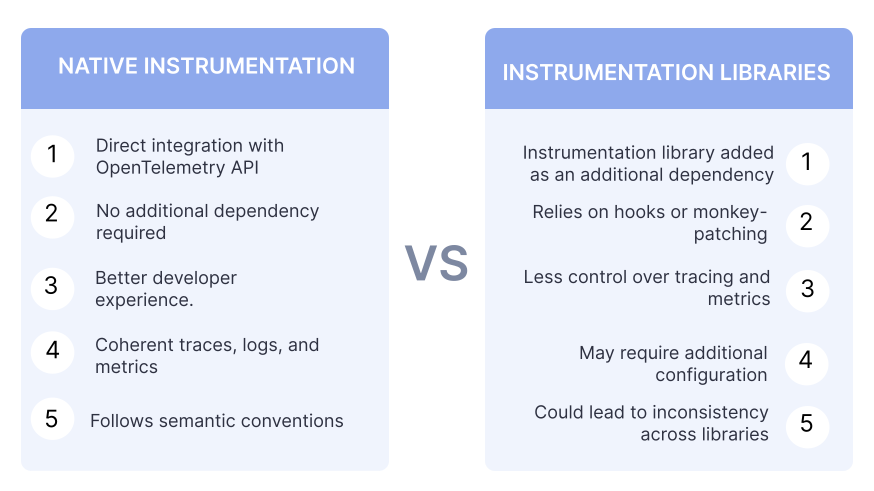

In order to make a system observable, it must be **instrumented**: That is, code
from the system's components must emit [traces](/docs/concepts/signals/traces/),
[metrics](/docs/concepts/signals/metrics/), and
[logs](/docs/concepts/signals/logs/).

Using OpenTelemetry, you can instrument your code in two primary ways:

1. [Code-based solutions](/docs/concepts/instrumentation/code-based) via
   official [APIs and SDKs for most languages](/docs/languages/)
2. [Zero-code solutions](/docs/concepts/instrumentation/zero-code/)

**Code-based** solutions allow you to get deeper insight and rich telemetry from
your application itself. They let you use the OpenTelemetry API to generate
telemetry from your application, which acts as an essential complement to the
telemetry generated by zero-code solutions.

**Zero-code** solutions are great for getting started, or when you can't modify
the application you need to get telemetry out of. They provide rich telemetry
from libraries you use and/or the environment your application runs in. Another
way to think of it is that they provide information about what's happening _at
the edges_ of your application.

You can use both solutions simultaneously.

## Additional OpenTelemetry Benefits

OpenTelemetry provides more than just zero-code and code-based telemetry
solutions. The following things are also a part of OpenTelemetry:

- Libraries can leverage the OpenTelemetry API as a dependency, which will have
  no impact on applications using that library, unless the OpenTelemetry SDK is
  imported.
- For each [signal](/docs/concepts/signals) (traces, metrics, logs) you have
  several methods at your disposals to create, process, and export them.
- With [context propagation](/docs/concepts/context-propagation) built into the
  implementations, you can correlate signals regardless of where they are
  generated.
- [Resources](/docs/concepts/resources) and
  [Instrumentation Scopes](/docs/concepts/instrumentation-scope) allow grouping
  of signals, by different entities, like, the
  [host](/docs/specs/semconv/resource/host/),
  [operating system](/docs/specs/semconv/resource/os/) or
  [K8s cluster](/docs/specs/semconv/resource/k8s/#cluster)
- Each language-specific implementation of the API and SDK follows the
  requirements and expectations of the
  [OpenTelemetry specification](/docs/specs/otel/).
- [Semantic Conventions](/docs/concepts/semantic-conventions) provide a common
  naming schema that can be used for standardization across code bases and
  platforms.
